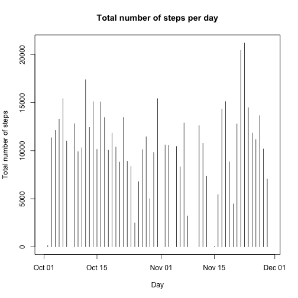
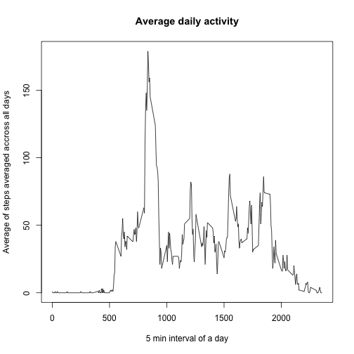
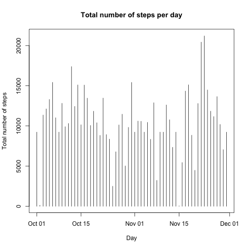
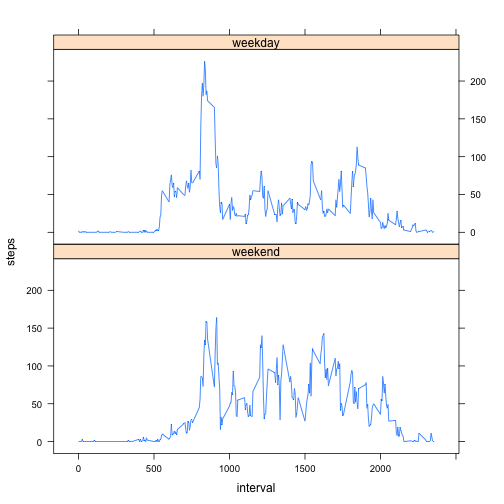

Relations between daily number of steps and activity patterns
============================================================

The data used for this research is the "Activity monitoring data" dataset

The variables included in this dataset are:  
- steps: Number of steps taking in a 5-minute interval (missing values are coded as NA)  
- date: The date on which the measurement was taken in YYYY-MM-DD format  
- interval: Identifier for the 5-minute interval in which measurement was taken  

The dataset is stored in a comma-separated-value (CSV) file and there are a total of 17,568 observations in this dataset.  

### First load the dataset and format the "date" in date format (Y-M-D)


```r
  stat <- read.csv(file="./data/activity.csv", header = T, sep =",", as.is = T)
  stat$date <- as.Date(stat$date,"%Y-%m-%d")
  numberOfDays <- length(unique(stat$date))
```


### What is mean total number of steps taken per day?

Here is an histogram showing the number of steps taken per day during the two months when the measures were taken.  


```r
plot(unique(stat$date), sapply(split(stat$steps, stat$date),sum),main = "Total number of steps per day",xlab="Day", ylab="Total number of steps", type ="h")
```

 


```r
sum_steps <- sapply(split(stat$steps, stat$date),sum, na.rm=T)
mean_steps <- as.integer(mean(sum_steps))
median_steps <- as.integer(median(sum_steps))
```

The mean of the total number of steps per day is 9354 and the median is 10395.


### What is the average daily activity pattern?


```r
interval_sum <- sapply(split(stat$steps, stat$interval),sum, na.rm=T)
average_interval <- as.integer(interval_sum/numberOfDays)
names(average_interval) <- names(interval_sum)
plot(unique(stat$interval), average_interval, type ="l",main = "Average daily activity",xlab="5 min interval of a day", ylab="Average of steps averaged accross all days")
```

 


The interval containing the maximum number of steps on average across all the days is at the  835 minute.


### Imputing missing values

Note that there are a 2304 of days/intervals where there are missing values (coded as NA). The presence of missing days may introduce bias into some calculations or summaries of the data.

To overcome this issue, I propose to fill in all of the missing values in the dataset by the average of steps taken of the same interval across this period.


```r
stat$steps[which(is.na(stat$steps))] <- average_interval[as.character(stat$interval[which(is.na(stat$steps))])]
```

Here is an histogram showing the number of steps taken per day during the two months after NA have been replaced.  


```r
plot(unique(stat$date), sapply(split(stat$steps, stat$date),sum),main = "Total number of steps per day",xlab="Day", ylab="Total number of steps", type ="h")
```

 


```r
sum_steps <- sapply(split(stat$steps, stat$date),sum, na.rm=T)
mean_steps <- as.integer(mean(sum_steps))
median_steps <- as.integer(median(sum_steps))
```

The mean of the total number of steps per day is 10564 and the median is 10395.

The fact to replace the missing values of step by the mean of the steps for the mean of all the other days, increased the total number of steps, nad increase the mean as well.

### Are there differences in activity patterns between weekdays and weekends?

For this part the weekdays() function may be of some help here. Use the dataset with the filled-in missing values for this part.

Create a new factor variable in the dataset with two levels ??? ???weekday??? and ???weekend??? indicating whether a given date is a weekday or weekend day.


```r
week <- data.frame ( c("Monday", "Tuesday", "Wednesday", "Thursday", "Friday", "Saturday", "Sunday"), c(rep("weekday",5), rep("weekend",2)))
names(week) <- c("day","type")
day <- weekdays(stat$date)
day <- week$type[match(day, week$day)]
stat <- cbind(stat, day)
```

Here is a panel plot containing a time series plot of the 5-minute interval (x-axis) and the average number of steps taken, averaged across all weekday days or weekend days (y-axis). 


```r
stat_weekday <- subset(stat, day == "weekday")
interval_sum_weekday <- sapply(split(stat_weekday$steps, stat_weekday$interval),sum, na.rm=T)
average_interval_weekday <- as.integer(interval_sum_weekday/length(unique(stat_weekday$date)))
average_interval_weekday <- data.frame(average_interval_weekday, unique(stat$interval), rep("weekday", length(average_interval_weekday)))
names(average_interval_weekday) <- c("steps", "interval", "day")

stat_weekend <- subset(stat, day == "weekend")
interval_sum_weekend <- sapply(split(stat_weekend$steps, stat_weekend$interval),sum, na.rm=T)
average_interval_weekend <- as.integer(interval_sum_weekend/length(unique(stat_weekend$date)))
average_interval_weekend <- data.frame(average_interval_weekend, unique(stat$interval), rep("weekend", length(average_interval_weekend)))
names(average_interval_weekend) <- c("steps", "interval", "day")

average_interval_all = rbind(average_interval_weekend,average_interval_weekday)

library(lattice)
xyplot(steps ~ interval | day, data = average_interval_all, layout = c(1, 2), type = "l")
```

 
